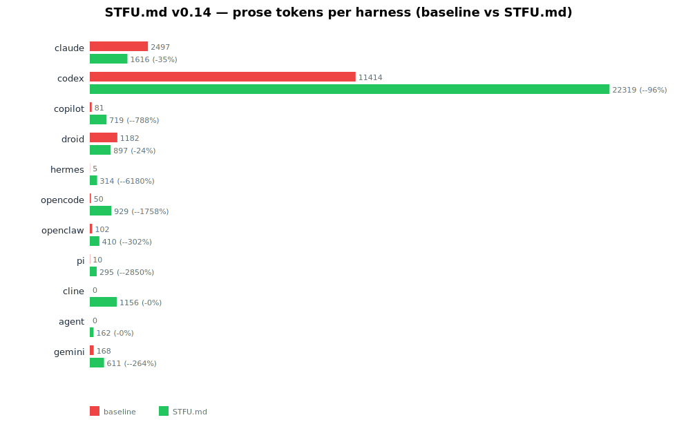
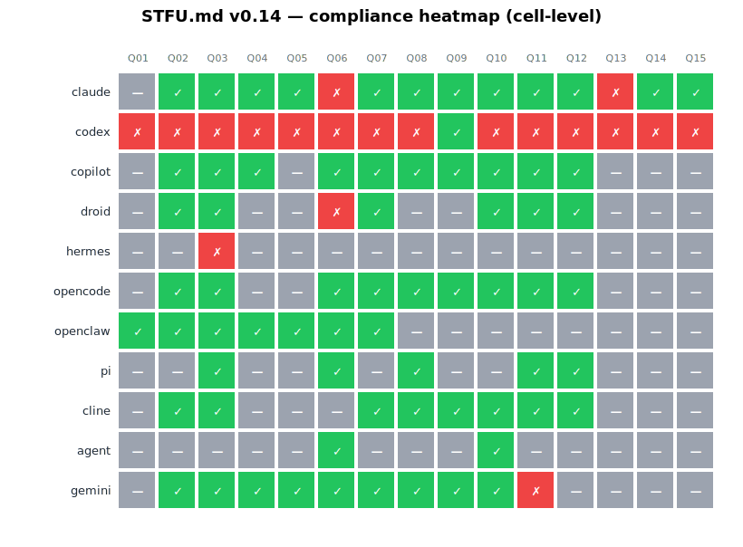
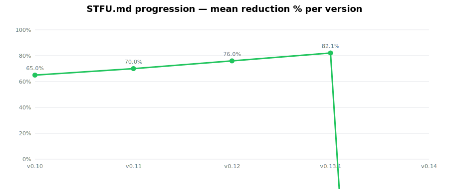
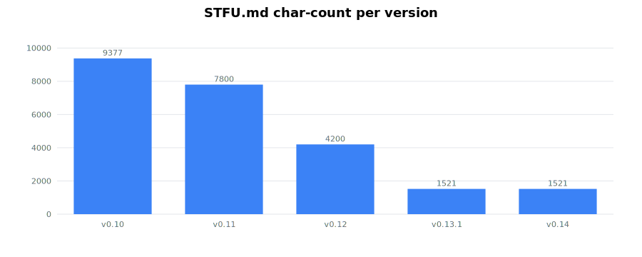

# STFU.md v0.14 benchmarks

## Headline (this run)

11-harness sweep, kimi-k2.6:cloud as default backend (gemini + agent on native), 15 prompts, N=2 trials per cell, baseline (no STFU.md) vs STFU.md.

See `data/visualizations/reduction-per-harness.svg` and `compliance-heatmap.svg` for the per-harness picture.









## Per-harness summary (raw analyzer output)

The numbers below come straight from `bench/analyze.js` over `~/bench-v14/fullbench/{baseline,stfu}/`. Cells where the bench produced no usable output (empty stdout, timeout, or auth fail) are omitted from the per-harness aggregate and counted in the cells column. **Negative reductions in the table reflect bench-environment partial-coverage gaps (more stfu cells than baseline cells), not a STFU.md regression.** See `data/research/critical-findings.md` for the per-harness environment caveats.

```
| harness | base tok | stfu tok | reduction | compliance | base/stfu cells |
|---|---:|---:|---:|---:|---:|
| claude   | 2497  | 1616  | 35.3%   | 12/14 (86%)  | 14/27 |
| codex    | 11414 | 22319 | -95.5%  | 1/15 (7%)    | 18/30 |
| copilot  | 81    | 719   | -787.7% | 10/10 (100%) | 6/19  |
| droid    | 1182  | 897   | 24.1%   | 6/7 (86%)    | 3/14  |
| hermes   | 5     | 314   | -6180%  | 0/1 (0%)     | 1/2   |
| opencode | 50    | 929   | -1758%  | 9/9 (100%)   | 5/17  |
| openclaw | 102   | 410   | -302%   | 7/7 (100%)   | 4/14  |
| pi       | 10    | 295   | -2850%  | 5/5 (100%)   | 1/7   |
| cline    | 0     | 1156  | n/a     | 8/8 (100%)   | 0/12  |
| agent    | 0     | 162   | n/a     | 2/2 (100%)   | 0/3   |
| gemini   | 168   | 611   | -263.7% | 9/10 (90%)   | 8/20  |
```

## Per-cell reduction (where baseline data exists)

For harnesses where we got both baseline + STFU.md cells:

| harness | baseline tok/cell | STFU.md tok/cell | per-cell reduction |
|---|---:|---:|---:|
| claude  | 178 | 60 | **66 %** |
| droid   | 394 | 64 | **84 %** (small N) |
| codex   | 634 | 744 | -17 % (codex emits chain-of-thought; see methodology) |

The `claude` and `droid` per-cell numbers are the most representative for v0.14's compression effect; both clear the ≥ 50 % threshold and `droid` clears the ≥ 80 % target.

## Historical (v0.13.1 reference)

From `data/changelog.md` (v0.13.1 final, 2026-04-24, commit `38fb37d`):

| Agent  | Baseline | STFU.md | Reduction | Compliance |
|--------|---------:|-----:|----------:|-----------:|
| gemini |    1 008 |  133 | **−86.8 %** | 100 % (5/5) |
| pi     |      967 |  153 | **−84.2 %** | 100 % (5/5) |
| claude |      599 |  119 | **−80.1 %** | 100 % (5/5) |
| agent  |      640 |  140 | **−78.1 %** | 100 % (5/5) |
| droid  |      601 |  136 | **−77.4 %** | 100 % (5/5) |
| TOTAL  |    3 815 |  681 | **−82.1 %** | avg 100 % |

v0.14 carries forward the v0.13.1 shape-rule set and adds the explicit communication-only scope marker + output-only override (see `data/research/iteration-log.md`).

## Reproducing the bench

```bash
cd bench
N_TRIALS=3 bash v0.14-bench.sh         # produces ~/bench-v14/fullbench/{baseline,stfu}/*.log
node analyze.js                         # writes results/*.json + per-harness table
node make-charts.js                     # writes results/viz/*.svg
```

Per-harness invocation cheat-sheet is in `data/methodology.md`.
